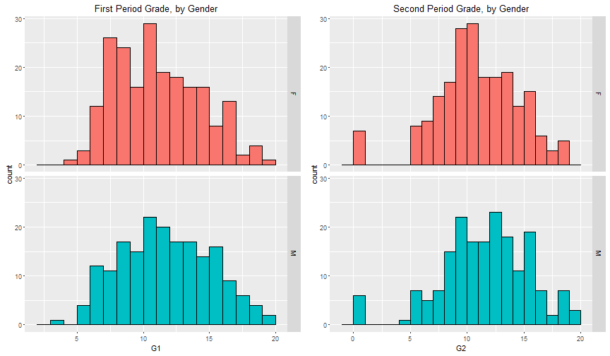

---
title       : Final Grade Prediction by Period Grades and Gender 
subtitle    : Coursera Developing Data Products Project
author      : Zhun Xu
job         : 
framework   : io2012        # {io2012, html5slides, shower, dzslides, ...}
highlighter : highlight.js  # {highlight.js, prettify, highlight}
hitheme     : tomorrow      # 
widgets     : [bootstrap, quiz, shiny, interactive]            # {mathjax, quiz, bootstrap}
mode        : selfcontained # {standalone, draft}
knit        : slidify::knit2slides

--- .class #id 

## Introduction

- Get student data including their demorgraphic information and course grades
- Compare period grade by gender
- Build regression model to predict final grade 
- Present the predict result with Shiny App

--- .class #id 

## Data Resource  

- Student achievement in secondary education of two Portuguese schools  
- Collected from school reports and questionnaires    
- Using Math course record in this project  
- URL: https://archive.ics.uci.edu/ml/datasets/Student+Performance# 
 

```r
temp <- tempfile()
download.file("https://archive.ics.uci.edu/ml/machine-learning-databases/00320/student.zip",temp, mode="wb")
con <- unzip(temp, "student-mat.csv")
data <- read.table(con, sep=";", skip=0, header=T)
unlink(temp)
```

--- .class #id 

## First and Second Period Grade by Gender


--- .class #id 

## Analysis Method 
	
- Using linear regression model  
- Independent Variables: first period grade, second period grade, and gender  
- Outcome: final grade


```r
fit.G3 <- lm(G3 ~ G1 + G2 + sex, data)
coef(fit.G3)
```

```
## (Intercept)          G1          G2        sexM 
##  -1.8878066   0.1518633   0.9857463   0.1798199
```

--- .class #id

## Predict Final Grade with Shiny App 

https://zhunxu.shinyapps.io/Project_Final_Grade/


